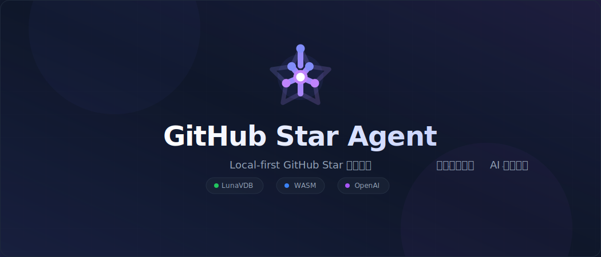

# StarLens

[English](README.md) | [简体中文](README.zh-CN.md)

  

  <h1 align="center">StarLens</h1>
  
Local-first GitHub Star manager · semantic vector search · AI tagging

Local-first GitHub Star manager: sync your starred repos, generate AI summaries/tags with a WASM vector engine (LunaVDB), and search with natural language plus filters and incremental sync.

## Features

- GitHub PAT/OAuth login, incremental star sync (fetch latest pages only, auto stop).
-,Local IndexedDB storage; WASM LunaVDB snapshot kept in-browser for instant resume.
- AI summaries/tags + vector embeddings, natural-language search.
- Filters/sorting: language, tags, latest, star count, indexed-first.
- shadcn UI, card layout, infinite scroll.

## Quick Start

1. `npm install` then `npm run dev`.
2. Go to **Settings**:
   - Add GitHub Personal Access Token (at least `read:user` + `public_repo` to read stars).
   - Add OpenAI-compatible API Key and optional Base URL (default `https://api.openai.com/v1`).
3. Back to Dashboard:
   - Click **Sync Stars** to pull stars (full on first run, incremental later).
   - Click **Index All** to generate AI summaries/tags and vectorize; progress shows at top.
4. Use the search box with natural language; combine language/tag filters and sorting to find repos fast.

## Development Notes

- Stack: React + TypeScript + Vite + Dexie + shadcn/ui + LunaVDB (WASM).
- Tables: `repositories`, `syncState`, `settings`, `vectorStore` (vector snapshot + version).
- To rebuild vectors, clear IndexedDB or bump `VECTOR_SNAPSHOT_VERSION` and re-index.